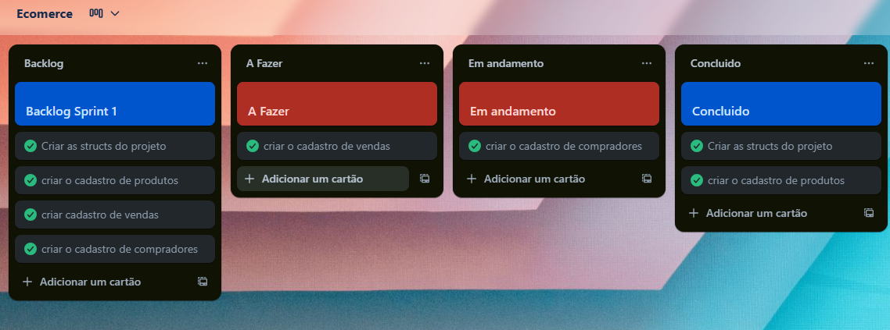
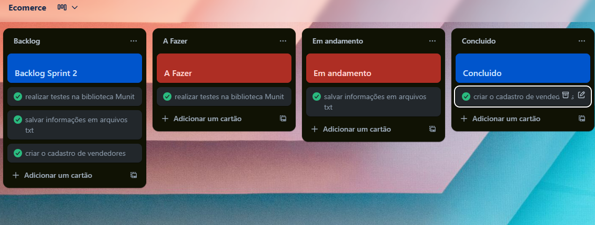
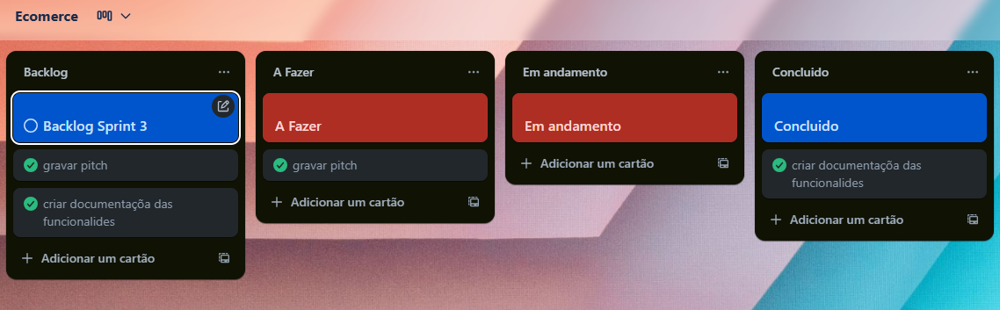
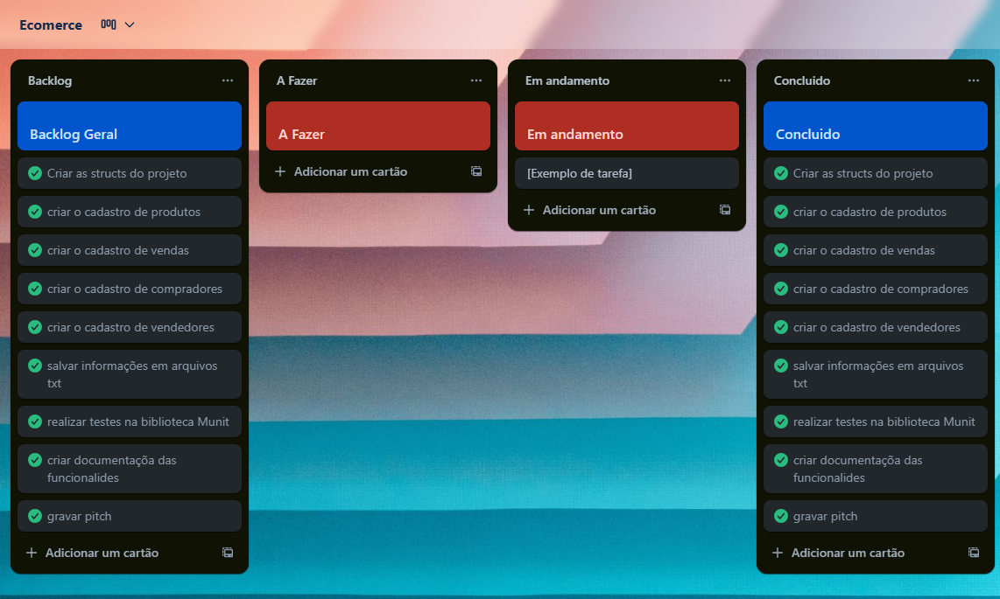

# 📄 Documentação do Projeto E-commerce

## ✅ Casos de Teste

Para garantir a qualidade e o bom funcionamento das principais funcionalidades do sistema, foram elaborados e executados testes utilizando a biblioteca [Munit](https://nemequ.github.io/munit/).

Foram testados os seguintes pontos:

- **Cadastro de Produto:** Verificou-se se os dados foram armazenados corretamente no vetor de produtos.
- **Busca por Código do Produto:** Testou-se a busca bem-sucedida e uma busca inválida.
- **Atualização da Comissão do Vendedor:** A comissão foi calculada com base em 3% do valor da venda e somada corretamente ao valor de comissões do vendedor.
- **Inserção de Venda:** Simulou-se a venda com produtos, comprador e vendedor, garantindo a atualização de estoque e comissões.

Todos os testes passaram com sucesso, demonstrando que os métodos estão funcionando corretamente com as entradas esperadas.

---

## 🚀 Planejamento das Sprints

### 📌 Sprint 1

As tarefas iniciais focaram na base do projeto:

- ✅ Criar as structs do projeto
- ✅ Criar o cadastro de produtos
- ✅ Criar cadastro de vendas
- ✅ Criar o cadastro de compradores

Estas funcionalidades foram implementadas com sucesso, permitindo o armazenamento e manipulação dos dados iniciais do sistema.

---

### 📌 Sprint 2

As tarefas da Sprint 2 foram voltadas à persistência dos dados e à realização de testes:

- ✅ Criar o cadastro de vendedores
- ✅ Salvar informações em arquivos `.txt`, utilizando o separador `;`
- ✅ Implementar testes automatizados com a biblioteca Munit

Nesta sprint, também foi possível simular a execução do sistema do início ao fim, com inserção, leitura e persistência dos dados entre sessões.

---

### 📌 Sprint 3

Nesta sprint final, as tarefas se concentraram em documentação e finalização:

- ✅ Gravar o pitch do projeto
- ✅ Criar a documentação das funcionalidades

Foram concluídas todas as tarefas, além da preparação dos arquivos `.md`, imagens e documentos finais exigidos para entrega.

---

### 📌 Sprint Geral (Consolidação)

A Sprint Geral resume todas as entregas e valida que:

- Todos os cadastros (produtos, vendedores, compradores, vendas) foram feitos
- Os dados estão sendo armazenados corretamente em arquivos `.txt`
- Os testes automatizados foram realizados com sucesso
- A documentação técnica está completa

---

## 👤 Desenvolvimento Individual

Este projeto foi desenvolvido de forma **individual**, sendo responsabilidade única do autor todo o processo de modelagem, codificação, teste, documentação e apresentação do sistema. A experiência proporcionou um aprendizado significativo em organização de backlog, escrita de testes automatizados, uso de arquivos `.txt` como persistência e documentação em Markdown.
